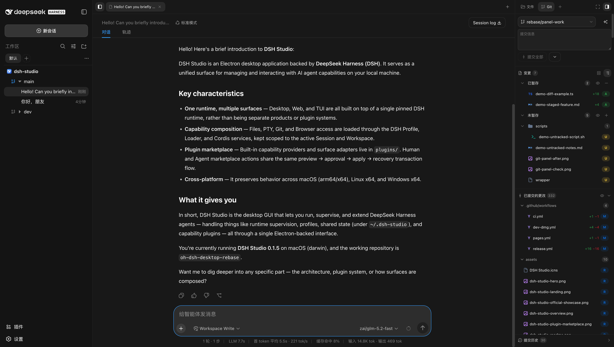

<p align="center">
  <a href="./README.md">简体中文</a> ·
  <strong>English</strong>
</p>

<div align="center">
  
  <h1>DSH Studio</h1>
  <p><strong>A local development workbench for DeepSeek Harness.</strong></p>
  <p>Manage conversations, files, Git review, terminals, and plugins in one project workspace.</p>
</div>

<p align="center">
  <a href="https://github.com/euanguo/dsh-studio/releases/latest"></a>
  <a href="https://github.com/euanguo/dsh-studio/stargazers"></a>
  
  
  <a href="./LICENSE"></a>
</p>

<p align="center">
  <a href="https://github.com/euanguo/dsh-studio/releases/latest"><strong>Download the latest release</strong></a>
  ·
  <a href="./docs/usage.en.md">Usage guide</a>
  ·
  <a href="./docs/design.en.md">Design guide</a>
</p>

<p align="center">
  
</p>

DSH Studio is built on the DeepSeek Harness runtime. It brings AI agents, workspaces, local development tools, and the plugin ecosystem into an installable Desktop/Web workbench. Model services can still run in the cloud; projects, sessions, terminals, files, Git review, browser state, and plugin state are organized by one local workspace.

## Interface preview

<table>
  <tr>
    <td width="50%" valign="top">
      <h3>🗂️ Project tree — left rail</h3>
      <p>Project → Worktree → Session tree with multiple projects, branches, groups, aliases, project icons, search, and persistent view state.</p>
      
    </td>
    <td width="50%" valign="top">
      <h3>🔍 Git review — right rail</h3>
      <p>Staged / unstaged / untracked sections, commit history, commit file trees, committed / unpushed diffs, and review targets on code lines.</p>
      
    </td>
  </tr>
  <tr>
    <td width="50%" valign="top">
      <h3>📄 Diff viewer</h3>
      <p>Multi-file path tree, line-level diff, image diff, conflict view, and inline comment targets for committed and unpushed changes.</p>
      
    </td>
    <td width="50%" valign="top">
      <h3>📁 File browsing</h3>
      <p>Project-scoped file tree and file preview with search, sort, and quick navigation.</p>
      
    </td>
  </tr>
  <tr>
    <td width="50%" valign="top">
      <h3>🖥️ Project terminal</h3>
      <p>Native PTY, unified shell resolution, project-scoped sessions, streaming and replay — available as a center tab or right-rail panel.</p>
      
    </td>
    <td width="50%" valign="top">
      <h3>⚙️ Settings</h3>
      <p>General settings, model config, Agent presets, sidebar options, and skin switching in one panel shared across Desktop and Web.</p>
      
    </td>
  </tr>
  <tr>
    <td width="50%" valign="top" colspan="2">
      <h3>🧩 Plugin marketplace</h3>
      <p>Browse and manage DSH plugins from multiple sources. Candidates go through preview and approval, with source locking, bundle validation, apply, and restore flows.</p>
      
    </td>
  </tr>
</table>

## Features

<table>
  <tr>
    <td width="50%" valign="top">
      <h3>🗂️ Project → Worktree → Session</h3>
      <p>The left rail organizes context by project, Git worktree, and conversation. It supports multiple projects and branches, groups, aliases, icons, search, and persistent view state.</p>
    </td>
    <td width="50%" valign="top">
      <h3>🧰 Local development workbench</h3>
      <p>The center conversation area works with a right-side tool area. Project-scoped PTY, file browsing, file viewers, browser tools, and subagent tools stay in one workspace.</p>
    </td>
  </tr>
  <tr>
    <td width="50%" valign="top">
      <h3>🔍 Git review</h3>
      <p>Inspect staged, unstaged, untracked, and conflicted changes; browse commit history and commit file trees; compare committed or unpushed changes; and keep review targets on code lines.</p>
    </td>
    <td width="50%" valign="top">
      <h3>🧩 Plugin marketplace</h3>
      <p>Browse and manage DSH plugins from multiple sources. Candidates go through preview and approval, with source locking, bundle validation, apply, and restore flows.</p>
    </td>
  </tr>
  <tr>
    <td width="50%" valign="top">
      <h3>🖥️ Desktop + Web</h3>
      <p>Desktop and Web share the same runtime, Profiles, plugins, and data boundaries. Desktop adds a native window and PTY, while Web fits browser and remote workspaces.</p>
    </td>
    <td width="50%" valign="top">
      <h3>🎨 Cross-surface skins</h3>
      <p>A shared DSW token and skin system covers the workspace, left rail, right rail, terminal, and settings while adapting readability to each surface.</p>
    </td>
  </tr>
</table>

### Experimental

Source Control AI is under active development. It generates commit messages from the current project changes and supports configurable models, reasoning effort, and prompt templates. It is not yet a stable release promise; descriptions and screenshots should follow actual verification.

## Download and install

Choose a distribution from [DSH Studio Releases](https://github.com/euanguo/dsh-studio/releases/latest):

| Distribution | Includes | Best for |
| --- | --- | --- |
| Full | **DSH Studio**, Web, Node runtime, and bundled plugins | Local development workbench |
| Web-only | **DSH Studio Web**, Node runtime, and Web plugins; no Electron | Browser, server, or small installs |

- **macOS:** open the DMG and drag **DSH Studio** into Applications.
- **Windows:** run the installer, or extract and launch the portable package.
- **Linux:** run the AppImage, or install the deb with `apt`.

The Web-only package is ready after extraction:

```sh
# Web UI, listening on http://127.0.0.1:3080 by default
./bin/dsh-studio web
```

### Install the unified command

The macOS full distribution contains a launcher that can be added to `PATH`:

```sh
sudo ln -sf \
  "/Applications/DSH Studio.app/Contents/Resources/bin/dsh-studio" \
  /usr/local/bin/dsh-studio
```

The Web-only package can run `./bin/dsh-studio` directly or be added to `PATH`.

## Usage

```sh
dsh-studio desktop          # Start DSH Studio
dsh-studio gui              # Desktop alias
dsh-studio web              # Start DSH Studio Web
dsh-studio web --port 3080  # Choose the Web port
```

Installed Desktop and Web use `~/.dsh-studio` for caches, configuration, sessions, credentials, and plugin state by default. Source launches from `pnpm start` / `pnpm dev` use `~/.dsh-studio-dev`, so a packaged app and a verification instance can run side by side. Set `DSH_STUDIO_HOME` to move the shared data root, or use `--channel stable|dev` / `DSH_STUDIO_CHANNEL` to choose the default pair.

## What this project is built on

DSH Studio is a downstream fork of [hust-open-atom-club/oh-dsh](https://github.com/hust-open-atom-club/oh-dsh). It continues to use [DeepSeek Harness](https://github.com/deepseek-ai/deepseek-harness) for the DSH runtime, Profiles, sessions, workspaces, and plugin contracts.

| Area | Source and boundary |
| --- | --- |
| DSH runtime | Runs on a pinned runtime from [deepseek-ai/deepseek-harness](https://github.com/deepseek-ai/deepseek-harness) |
| Project source | Continued development from [hust-open-atom-club/oh-dsh](https://github.com/hust-open-atom-club/oh-dsh) |
| Left rail | Forks the official `packages/client/ui-workspace` and reshapes it into Project → Worktree → Session; the official row is disabled and DSH Studio mounts its own desktop-left-rail |
| Right-rail Host | Adapted and vendored from [omdsh-dev/DSH-better-sidebar](https://github.com/omdsh-dev/DSH-better-sidebar) |
| Right-rail client/UI | Not a verbatim copy of the upstream UI; DSH Studio owns the file, Git review, Center Surface, project scope, plugin registration, and desktop layout implementations |
| Diff / terminal references | Public implementations and algorithms from [pierre](https://github.com/pierrecomputer/pierre) and [orca](https://github.com/stablyai/orca), with attribution preserved |

DSH Studio therefore does not claim to be a simple reskin or a complete copy of Better Sidebar. It reuses clearly attributed runtime, Host, protocol, and third-party foundations, then builds its own project workspace, Git review, Center Surface, plugin marketplace, and Desktop/Web distribution layer.

## Documentation and ecosystem

- [Installation, operations, and troubleshooting](./docs/usage.en.md)
- [Architecture, design, and plugin boundaries](./docs/design.en.md)
- [DeepSeek Harness](https://github.com/deepseek-ai/deepseek-harness): DSH runtime, sessions, and plugin loader
- [DSH-better-sidebar](https://github.com/omdsh-dev/DSH-better-sidebar): source of the right-rail Host file, Git, and PTY capabilities
- [plugin-registry](https://github.com/vlln/plugin-registry): plugin sources, locking, and lifecycle reference
- [dsh-hub](https://github.com/omdsh-dev/dsh-hub): marketplace aggregation, trust, and candidate preview reference
- [dsh-suite](https://github.com/whyihaveyou/dsh-suite): plugin classification and management reference
- [pierre](https://github.com/pierrecomputer/pierre): diff, inline comments, and virtualized rendering reference
- [orca](https://github.com/stablyai/orca): terminal scrollback and commit-generation reference
- [dshfind](https://dshfind.com/): DSH plugin marketplace and ecosystem community

For the complete third-party license, pinned revision, and adaptation boundaries, see [THIRD_PARTY_NOTICES](./THIRD_PARTY_NOTICES.md).

## License

[MIT](./LICENSE)
