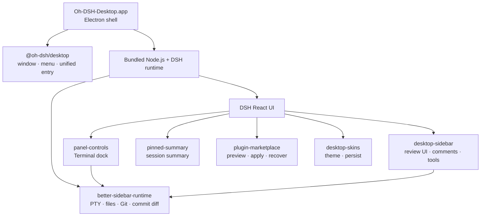

<p align="center">
  <a href="./README.md">简体中文</a> ·
  <strong>English</strong>
</p>

<div align="center">
  
  <h1>Oh-DSH-Desktop</h1>
  <p><strong>DeepSeek Harness, packaged as an installable and extensible desktop workbench.</strong></p>
  <p>
    <a href="#installation">Installation</a> ·
    <a href="#architecture">Architecture</a> ·
    <a href="#bundled-plugins">Bundled Plugins</a> ·
    <a href="#local-build-and-release">Build and Release</a>
  </p>
</div>

<p align="center">
  
  
  
  
  
</p>

<p align="center">
  
  <br>
  <sub>Main interface, Side Panel, and the Porcelain desktop skin</sub>
</p>

Oh-DSH-Desktop keeps the DSH React UI and packages a pinned DSH runtime,
Node.js, Electron, and local capabilities into a macOS application. Models
still run in the cloud. The desktop owns the terminal, workspaces, Git,
browser, window integration, and plugin lifecycle.

It is not a second DSH frontend and requires neither a separate Web Terminal
nor a shell plugin. `@oh-dsh/desktop` is the unified desktop entry while
feature modules retain the official DSH Profile, Loader, locale, settings,
and ThemeService contracts.

## Capabilities

- Self-contained Apple Silicon macOS application and installers.
- Multi-tab PTY Terminal, commit/line Review, Browser, and Files.
- Review comments attach to the message composer for direct Agent handling.
- Pinned Summary, expandable Side Panel, and native window controls.
- Plugin marketplace with isolated preview, discard, apply, and recovery.
- Live Chinese/English switching and four original Oh-DSH skins.
- One transaction and approval boundary for human and Agent plugin actions.

## Interface preview

**Plugin marketplace**: browse the `dsh-external` catalog and preview changes
in an isolated environment.

<p align="center">
  
</p>

**Desktop skins**: switch instantly from DSH Settings, with the selection
persisted by the Host.

<p align="center">
  
</p>

## Installation

### Install a test build

Download from
[GitHub Releases](https://github.com/dsh-external/oh-dsh-desktop/releases):

- `Oh-DSH-Desktop-0.1.2-arm64.dmg`
- `Oh-DSH-Desktop-0.1.2-arm64.zip`

Open the DMG and drag `Oh-DSH-Desktop.app` into `Applications`. The current
test build has no Developer ID signature or notarization. On first launch,
right-click the application in Finder and choose **Open** if required.

### Run from source

Requirements: macOS 12+, Apple Silicon, Node.js 24+, pnpm 11+, and Xcode
Command Line Tools.

```sh
(the Better Sidebar Host is vendored at `plugins/better-sidebar-runtime/src/` — no sibling clone needed)
pnpm install
pnpm run build:dsh
pnpm start
```

The Better Sidebar Host is compiled directly from the local clone in the
vendored Host tree (`plugins/better-sidebar-runtime/src/`, baseline v0.10.2 `3d88752` + local extensions);
neither SSH nor GitHub CLI authentication is required to clone it. The pinned
DSH source is acquired separately and can also be provided through the
`DSH_SOURCE` override described below.

Release builds pin DSH `0.0.1-rc.2` at:

```text
7b9644f2b664e46c9518506035aa6c8d5af4d8e8
```

The first build stores the source under `.cache/dsh-source/`. Set
`DSH_SOURCE=/absolute/path` to use another checkout; its package version must
still match the pinned version.

Writable runtime state lives at:

```text
~/Library/Application Support/Oh-DSH-Desktop/dsh
```

Configure the DeepSeek API key in DSH Settings or in the `.env` file under
that directory.

## Desktop controls

| Action | Shortcut |
| --- | --- |
| Toggle the DSH left sidebar | `⌘B` |
| Toggle the bottom Terminal | `⌘J` |
| Toggle the Side Panel | `⌥⌘B` |
| Open Review | `⌃⇧G` |
| Open Browser | `⌘T` |
| Open Files | `⌘P` |
| Start a Side chat | `⌥⌘S` |
| Leave Side Panel focus mode | `Esc` |

Opening the Side Panel collapses Pinned Summary and reveals the expand
control. Terminal and Side Panel remain independently toggleable.

## Architecture



`cordis.patch.yml` reuses `dsh-base` and `dsh-web-app`, starts the Web runtime
on a random loopback port, and loads desktop plugins in dependency order.
Third-party plugins remain managed by the DSH Profile and Loader.

## Bundled plugins

| Plugin | Upstream relationship | Oh-DSH adaptation |
| --- | --- | --- |
| `@oh-dsh/desktop` | Original Oh-DSH component | Unified desktop entry, Electron bridge, native menus, windows, Agent capabilities, and bundled plugin order |
| `@oh-dsh/better-sidebar-runtime` | Compiles the vendored [`DSH-better-sidebar`](https://github.com/omdsh-dev/DSH-better-sidebar) Host (`plugins/better-sidebar-runtime/src/`, baseline `3d88752` v0.10.2 + local extensions) | Compiles the upstream Host only for PTY, Files, Git, history, and commit diff; the upstream UI is not loaded |
| `@oh-dsh/panel-controls` | Downstream adaptation of [`dsh-web-panel`](https://github.com/dsh-external/dsh-web-panel) | Keeps the Oh-DSH Terminal dock, themes, localization, and Session state on the shared PTY Host; no separate Web Terminal installation |
| `@oh-dsh/pinned-summary` | Original Oh-DSH component | Active Session summary, half-height card, and conversation gutter |
| `@oh-dsh/desktop-sidebar` | Oh-DSH UI downstream of [`DSH-better-sidebar`](https://github.com/omdsh-dev/DSH-better-sidebar) | Uses the shared Host for Session tabs, viewers, Files, Git Review, line comments, and Agent composer references while retaining the current layout, icons, and themes |
| `@oh-dsh/plugin-marketplace` | Distills [`plugin-registry`](https://github.com/dsh-external/plugin-registry) and [`dsh-hub`](https://github.com/dsh-external/dsh-hub) | Unifies isolated preview, risk review, TOFU source locks, apply, and recovery with desktop navigation and bilingual UI |
| `@oh-dsh/desktop-skins` | Downstream adaptation of [`dsh-skins`](https://github.com/dsh-external/dsh-skins) | Retains the ThemeService extension model but redesigns skins, Settings UI, and Host persistence |

Plugins marked as downstream adaptations or distilled designs are reviewed
against upstream releases and features regularly. Compatible features are
ported through the current DSH contracts; syncing does not overwrite Oh-DSH
UI, themes, or desktop interactions.

See [THIRD_PARTY_NOTICES.md](./THIRD_PARTY_NOTICES.md) for source and license
details.

## Plugin marketplace

The **Plugins** page browses the `dsh-external` catalog. Install, update,
enable, disable, and uninstall operations first create an isolated candidate
Profile:

```text
verify the source and exact commit
        ↓
install and launch an isolated preview Profile
        ↓
discard (live desktop unchanged) or apply (retain previous)
        ↓
Undo restores the previous Profile when needed
```

The Agent can enter the same workflow through conversation. Apply and recover
still require human approval and cannot bypass preview or introduce a second
DSH Loader. Private repositories authenticate through GitHub CLI:

```sh
gh auth login
```

## Security boundaries

- DSH Web runtime and Agent management bind only to random loopback ports.
- Browser uses an isolated Electron partition without Node.js or preload.
- The Better Sidebar Host enforces Session and Workspace bounds for Files and Git.
- Marketplace candidates pin Git commits, block install scripts by default,
  and leave the live Profile unchanged until apply.
- The pnpm release-age policy stays enabled, excluding only `@deepseek-ai/*`.

## Local build and release

A complete build rebuilds the pinned DSH source. Use the quick build when the
cache is already current:

```sh
pnpm run dist:mac
# or
pnpm run dist:mac:quick
```

Artifacts are written to `release/`:

```text
release/
├── Oh-DSH-Desktop-0.1.2-arm64.dmg
├── Oh-DSH-Desktop-0.1.2-arm64.zip
└── mac-arm64/Oh-DSH-Desktop.app
```

The repository does not currently rely on GitHub Actions for release builds.
Verify locally before upload:

```sh
pnpm run typecheck
pnpm test
pnpm run dist:mac
pnpm run smoke:app
codesign --verify --deep --strict \
  release/mac-arm64/Oh-DSH-Desktop.app
hdiutil verify release/Oh-DSH-Desktop-0.1.2-arm64.dmg
```

After verification, create the Release manually. For an existing Release,
use `gh release upload --clobber` to replace the artifacts.

```sh
gh release create v0.1.2 \
  release/Oh-DSH-Desktop-0.1.2-arm64.dmg \
  release/Oh-DSH-Desktop-0.1.2-arm64.zip \
  --title "Oh-DSH-Desktop 0.1.2" \
  --generate-notes
```

## License

[BSD 3-Clause](./LICENSE)
