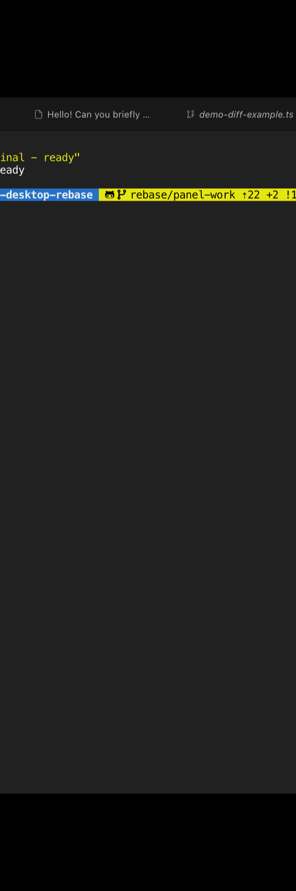

<p align="center">
  <strong>简体中文</strong> ·
  <a href="./README.en.md">English</a>
</p>

<div align="center">
  
  <h1>DSH Studio</h1>
  <p><strong>面向 DeepSeek Harness 的本地开发工作台</strong></p>
  <p>对话、文件、Git Review、终端与插件，都在同一个项目工作区里。</p>
</div>

<p align="center">
  <a href="https://github.com/euanguo/dsh-studio/releases/latest"></a>
  <a href="https://github.com/euanguo/dsh-studio/stargazers"></a>
  
  
  <a href="./LICENSE"></a>
</p>

<p align="center">
  <a href="https://github.com/euanguo/dsh-studio/releases/latest"><strong>下载最新版</strong></a>
  ·
  <a href="./docs/usage.md">使用文档</a>
  ·
  <a href="./docs/design.md">设计文档</a>
</p>

<p align="center">
  
  <br><em>左栏项目树 · 中间多标签会话区（对话 / 终端 / 浏览器）· 右栏 Git 面板</em>
</p>

DSH Studio 基于 DeepSeek Harness runtime 构建，把 AI Agent、Workspace、本地开发工具和插件生态装进一个可安装的 Desktop / Web 工作台。模型服务仍在云端按需运行；项目、会话、终端、文件、Git Review、浏览器和插件状态全部由本地工作区统一组织。

## 核心特性

<table>
  <tr>
    <td width="50%" valign="top"><b>🗂️ 多项目工作区</b><br>Project → Worktree → Session 三层组织，支持分组、别名与项目图标自动探测。</td>
    <td width="50%" valign="top"><b>🧰 一站式工具区</b><br>项目级 PTY、文件浏览与预览、浏览器、Subagent，不用在多个窗口间切换。</td>
  </tr>
  <tr>
    <td width="50%" valign="top"><b>🔍 Git Review</b><br>staged / unstaged / untracked 分区、提交历史、commit 文件树与行级审阅目标。</td>
    <td width="50%" valign="top"><b>🤖 智能提交</b><br>根据当前变更一键生成提交信息，模型与思考强度可配置。</td>
  </tr>
  <tr>
    <td width="50%" valign="top"><b>🖥️ Desktop + Web 同构</b><br>同一套 runtime、Profile、插件与数据边界，Desktop 提供原生窗口与 PTY。</td>
    <td width="50%" valign="top"><b>🧩 插件市场</b><br>多来源插件浏览与安装，候选预览、审批、来源锁定与恢复流程完整。</td>
  </tr>
</table>

## 界面预览

<h3>🗂️ 项目树与自动图标</h3>

左栏按 <b>Project → Worktree → Session</b> 三层组织工作上下文。每个项目的图标从项目目录的静态资源自动探测——优先读取 <code>package.json</code> 声明的 icon 字段，其次搜索项目内的 PNG 文件，也可以取项目主页 favicon 或 Git 平台头像——不需要手动配置就能显示项目专属图标。

<table align="center">
  <tr>
    <td width="50%" align="center" valign="top">
      
    </td>
    <td width="50%" align="center" valign="top">
      
    </td>
  </tr>
  <tr>
    <td align="center"><em>项目树：dsh-studio 项目下挂 main / dev 两个分支</em></td>
    <td align="center"><em>项目图标：自动读取自项目静态资源</em></td>
  </tr>
</table>

自动探测不理想时，右键项目即可换用内置图标或上传自定义 PNG。多项目、多分支、项目分组、别名、搜索和视图状态都会持久化保存。

<h3>🔍 Git Review 与智能提交</h3>

右栏 Git 面板把暂存区、未暂存、未跟踪分区和提交历史集中在同一个面板。点击<b>「生成提交信息」</b>，模型会根据当前变更自动写出提交标题和正文；生成后可以直接在输入框里修改，确认后一键提交全部暂存变更。

<p align="center">
  
  <br><em>已暂存 2 个文件，提交信息由模型根据变更内容生成</em>
</p>

每个分区都有<b>「查看全部」</b>：点击后暂存文件会展开为中心区域的独立标签页，左侧保留文件树导航，对照代码和 diff 更直观。

<p align="center">
  
  <br><em>「查看全部」打开的暂存文件标签页，左侧为文件树</em>
</p>

<h3>📄 Diff 查看器</h3>

点击 Git 面板中的任意文件，右栏即打开 diff 查看器：行级 diff、图片 diff、冲突查看、行内评论目标一应俱全，committed 与 unpushed 变更都可以对比。

<p align="center">
  
  <br><em>行级 diff，新增 / 删除行高亮，支持行内评论</em>
</p>

<h3>📁 文件浏览</h3>

右栏切到文件标签即可浏览项目级文件树并预览文件，支持搜索、排序和快速跳转。中心区域的对话标签保持打开，看文件不打断对话。

<p align="center">
  
  <br><em>项目文件树与文件预览，对话标签同时保持打开</em>
</p>

<h3>🖥️ 项目级终端</h3>

终端作为中心标签页打开：原生 PTY、统一的 shell 解析链、项目级作用域、流式输出与重放。对话和浏览器标签同时挂在标签栏，随时切换。

<p align="center">
  
  <br><em>中心区域的终端标签，与对话、浏览器标签并列</em>
</p>

<h3>⚙️ 设置面板</h3>

通用设置、模型配置、Agent 预设、侧边栏选项和皮肤切换集中在一个面板，Desktop 与 Web 共享同一套配置。

<p align="center">
  
  <br><em>设置面板：通用设置 / 模型 / 插件 / Agent 预设 / 侧边栏 / 主题皮肤</em>
</p>

<h3>🧩 插件市场</h3>

浏览和管理来自多个来源的 DSH 插件。安装前经过候选预览与审批，保留来源锁定、bundle 校验、应用和恢复流程。

<p align="center">
  
  <br><em>插件市场：已安装 / 未安装分类，支持搜索与来源筛选</em>
</p>

> **实验性功能** · Source Control AI 正在开发中：根据项目变更生成提交信息，支持模型、思考强度和提示词模板配置。该能力尚未作为稳定发行承诺。

## 下载与安装

从 [DSH Studio Releases](https://github.com/euanguo/dsh-studio/releases/latest) 选择发行形态：

| 发行形态 | 包含内容 | 适合场景 |
| --- | --- | --- |
| 完整版 | **DSH Studio**、Web、Node runtime 和内置插件 | 本地开发工作台 |
| Web-only | **DSH Studio Web**、Node runtime 和 Web 插件，不含 Electron | 浏览器、服务器或轻量安装 |

<details>
<summary><b>各平台安装步骤</b></summary>

- **macOS：** 打开 DMG，将 **DSH Studio** 拖入 Applications。
- **Windows：** 运行安装包，或解压便携版后启动。
- **Linux：** 直接运行 AppImage，或使用 <code>apt</code> 安装 deb。

Web-only 包解压后即可运行：

```sh
# Web UI，默认监听 http://127.0.0.1:3080
./bin/dsh-studio web
```

</details>

<details>
<summary><b>安装统一命令（可选）</b></summary>

macOS 完整版可将应用内的启动器加入 <code>PATH</code>：

```sh
sudo ln -sf \
  "/Applications/DSH Studio.app/Contents/Resources/bin/dsh-studio" \
  /usr/local/bin/dsh-studio
```

Web-only 包可直接运行 <code>./bin/dsh-studio</code>，也可以把它加入 <code>PATH</code>。

</details>

## 使用

```sh
dsh-studio desktop          # 启动 DSH Studio
dsh-studio gui              # Desktop 的启动别名
dsh-studio web              # 启动 DSH Studio Web
dsh-studio web --port 3080  # 指定 Web 端口
```

**数据目录：** 已安装的 Desktop 和 Web 默认共同使用 `~/.dsh-studio` 存放缓存、配置、会话、凭据与插件状态。源码里的 `pnpm start` / `pnpm dev` 默认改用 `~/.dsh-studio-dev`，正式版和验证实例可以同时开、互不抢数据。设置 `DSH_STUDIO_HOME` 可统一更换数据目录；`--channel stable|dev` 或 `DSH_STUDIO_CHANNEL` 在默认根目录之间切换。

## 我们基于什么构建

DSH Studio 是 [hust-open-atom-club/oh-dsh](https://github.com/hust-open-atom-club/oh-dsh) 的下游 fork，并继续使用 [DeepSeek Harness](https://github.com/deepseek-ai/deepseek-harness) 提供的 DSH runtime、Profile、Session、Workspace 和插件契约。

| 区域 | 来源与边界 |
| --- | --- |
| DSH runtime | 基于 [deepseek-ai/deepseek-harness](https://github.com/deepseek-ai/deepseek-harness) 的 pinned runtime 运行 |
| 项目来源 | 基于 [hust-open-atom-club/oh-dsh](https://github.com/hust-open-atom-club/oh-dsh) 继续开发 |
| 左栏 | fork 官方 `packages/client/ui-workspace`，改造成 Project → Worktree → Session；官方 row 被禁用，DSH Studio 使用自己的 desktop-left-rail |
| 右栏 Host | 基于 [omdsh-dev/DSH-better-sidebar](https://github.com/omdsh-dev/DSH-better-sidebar) 的 Host 能力改造并 vendor 到仓库内 |
| 右栏 client/UI | 不是上游 UI 的原样复制；文件、Git Review、Center Surface、项目级作用域、插件注册和桌面布局由 DSH Studio 自己实现或重写 |
| Diff / terminal 参考 | 分别参考 [pierre](https://github.com/pierrecomputer/pierre) 与 [orca](https://github.com/stablyai/orca) 的公开实现和算法，保留对应归属 |

DSH Studio 不是简单换皮，也不是完全复制 Better Sidebar：我们复用明确标注的 runtime、Host、协议和第三方基础，在其上构建自己的项目工作区、Git Review、Center Surface、插件市场和 Desktop/Web 发行层。

## 文档与生态

- [安装、操作与排错](./docs/usage.md) · [架构设计与插件边界](./docs/design.md)
- [DeepSeek Harness](https://github.com/deepseek-ai/deepseek-harness) — DSH runtime、会话与插件加载器
- [DSH-better-sidebar](https://github.com/omdsh-dev/DSH-better-sidebar) — 右栏 Host 的文件、Git 与 PTY 能力来源
- [dshfind](https://dshfind.com/) — DSH 插件超市与生态社区
- [LINUX DO](https://linux.do/) — 真实的开发者社区

<details>
<summary><b>更多参考项目</b></summary>

- [plugin-registry](https://github.com/vlln/plugin-registry)：插件来源、锁定和生命周期参考
- [dsh-hub](https://github.com/omdsh-dev/dsh-hub)：插件聚合、信任与候选预览参考
- [dsh-suite](https://github.com/whyihaveyou/dsh-suite)：插件分类与管理参考
- [pierre](https://github.com/pierrecomputer/pierre)：diff、行内注释与虚拟化渲染参考
- [orca](https://github.com/stablyai/orca)：终端滚动和提交生成思路参考

</details>

完整的第三方许可、固定版本与适配边界见 [THIRD_PARTY_NOTICES](./THIRD_PARTY_NOTICES.md)。

## License

[MIT](./LICENSE)
