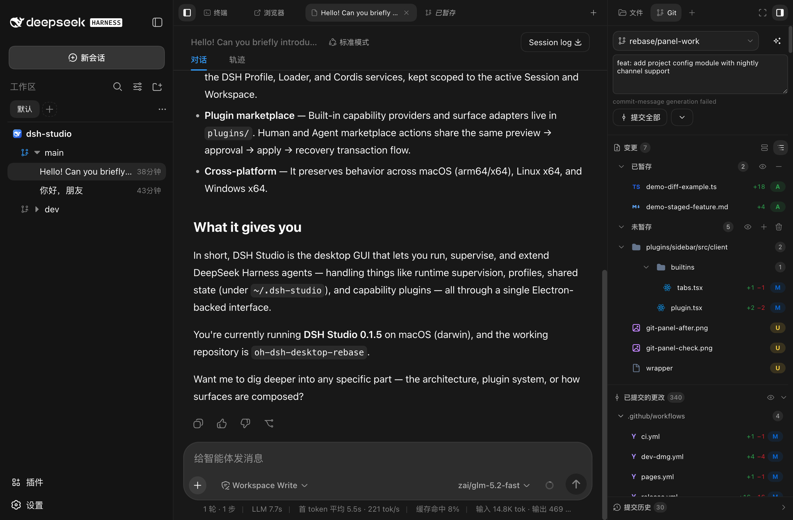
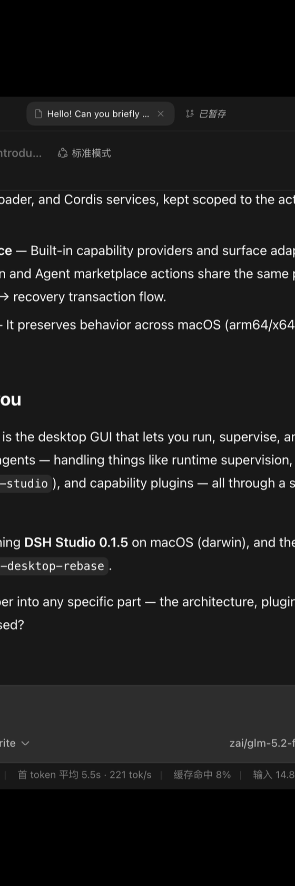
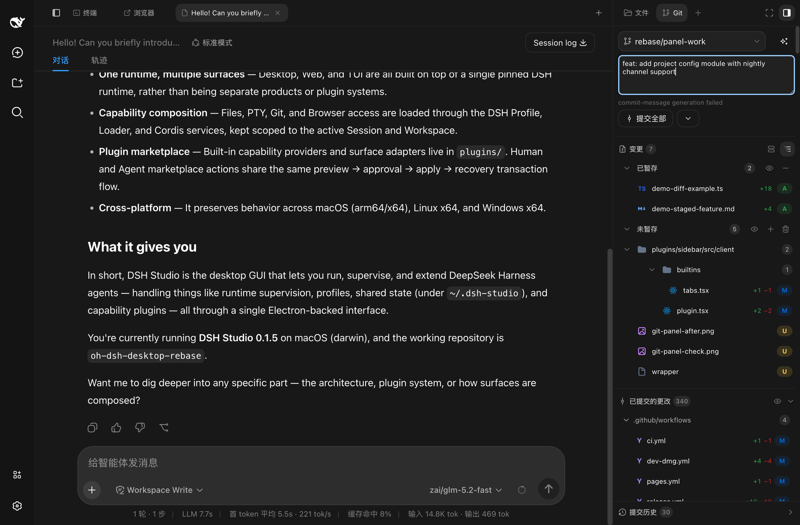
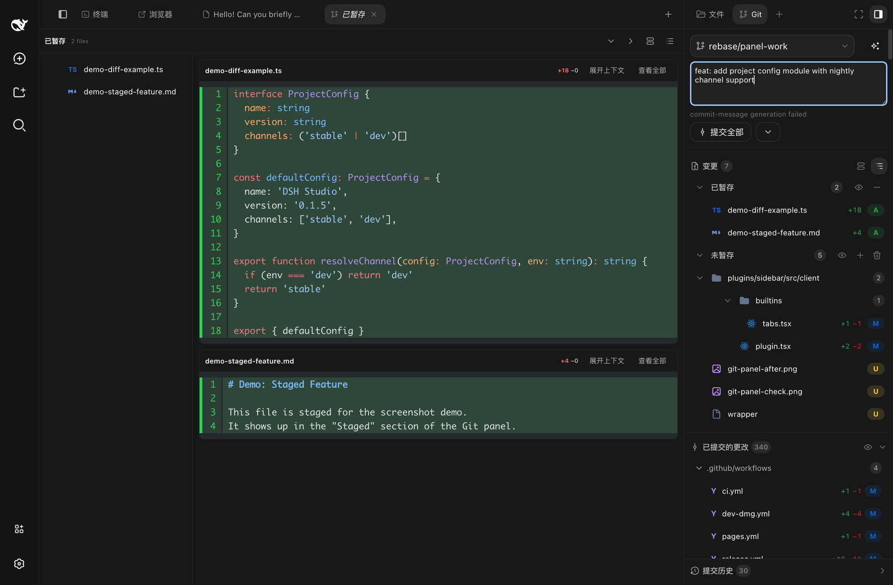
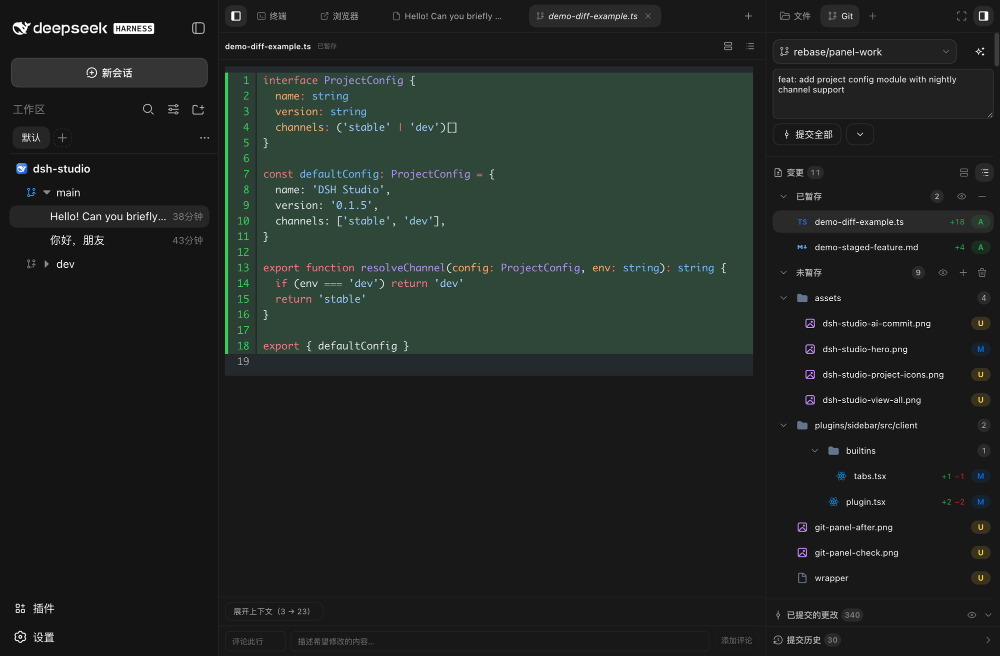
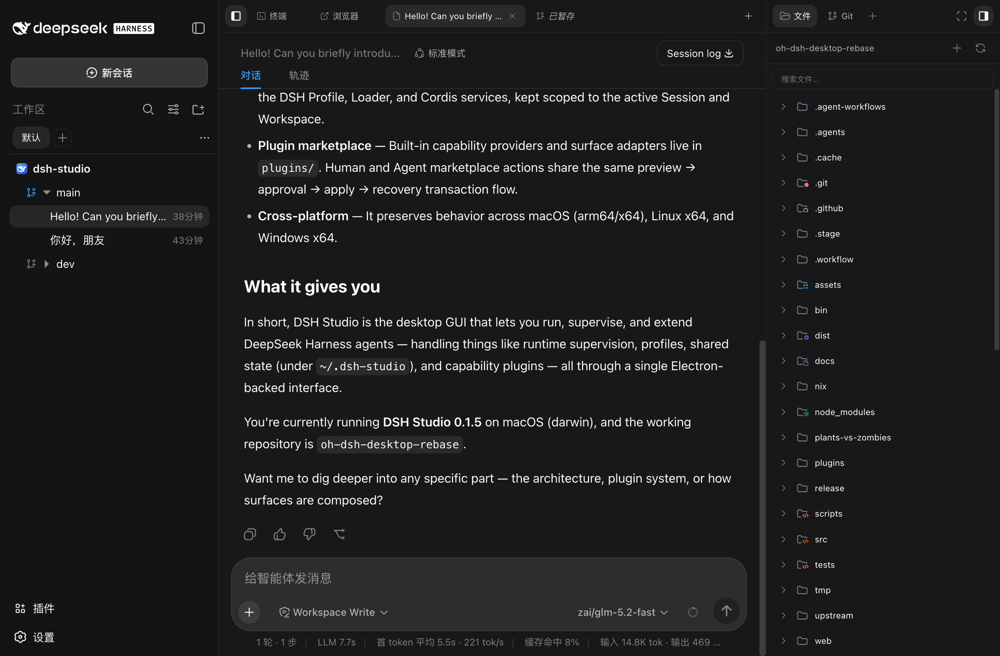
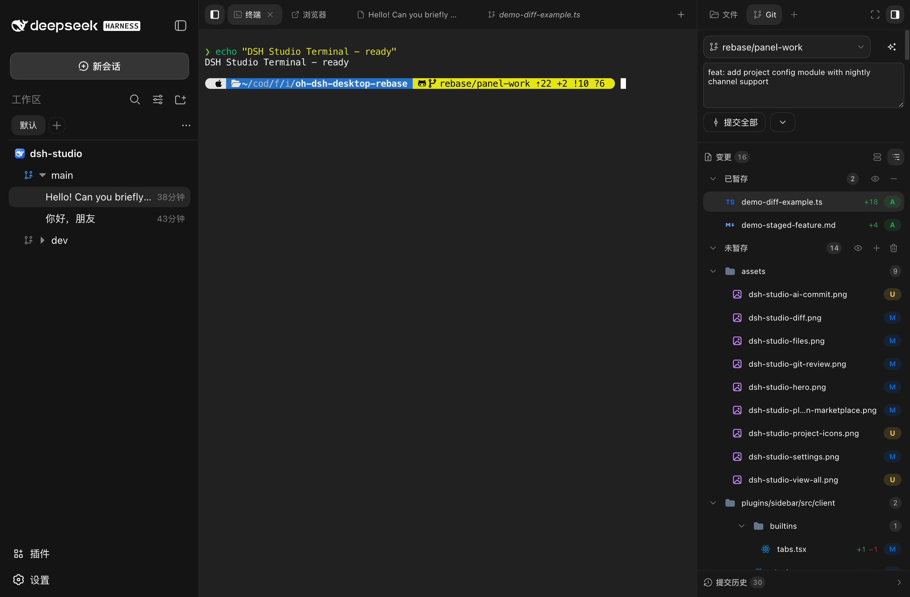
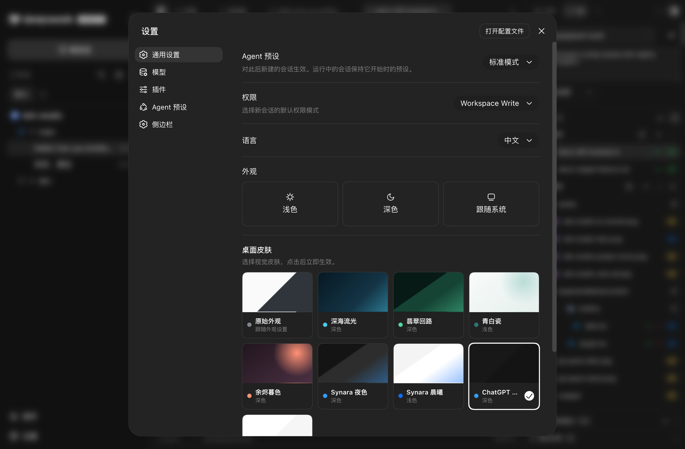
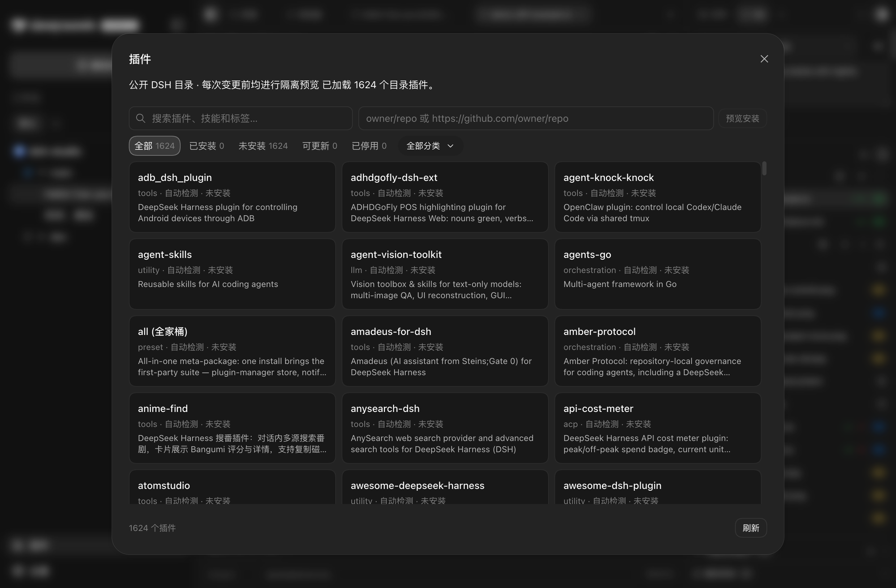

<p align="center">
  <strong>简体中文</strong> ·
  <a href="./README.en.md">English</a>
</p>

<div align="center">
  
  <h1>DSH Studio</h1>
  <p><strong>面向 DeepSeek Harness 的本地开发工作台。</strong></p>
  <p>在同一个项目工作区里管理对话、文件、Git Review、终端与插件。</p>
</div>

<p align="center">
  <a href="https://github.com/euanguo/dsh-studio/releases/latest"></a>
  <a href="https://github.com/euanguo/dsh-studio/stargazers"></a>
  
  
  <a href="./LICENSE"></a>
</p>

<p align="center">
  <a href="https://github.com/euanguo/dsh-studio/releases/latest"><strong>下载最新版</strong></a>
  ·
  <a href="./docs/usage.md">使用文档</a>
  ·
  <a href="./docs/design.md">设计文档</a>
</p>

<p align="center">
  
</p>

DSH Studio 基于 DeepSeek Harness runtime 构建，把 AI Agent、Workspace、本地开发工具和插件生态组织到一个可安装的 Desktop/Web 工作台中。模型服务仍可按需运行在云端；项目、会话、终端、文件、Git Review、浏览器和插件状态由本地工作区统一组织。

上图展示了 DSH Studio 的典型工作布局：左栏项目树列出多个项目和分支，中间区域同时挂载对话、终端和浏览器三个标签页并停留在对话标签，右栏 Git 面板实时显示暂存区与变更。

## 界面预览

### 🗂️ 项目树与自动图标

左栏按 **Project → Worktree → Session** 三层组织工作上下文。每个项目的图标会自动探测项目目录中的静态资源——优先读取 `package.json` 声明的 icon 字段，其次搜索项目内的 PNG 文件，还可以从项目主页 favicon 或 Git 平台头像获取——无需手动配置即可显示项目专属图标。

<p align="center">
  
</p>

如果自动探测不符合预期，也可以右键项目手动设置内置图标或上传自定义 PNG。左栏同时支持多项目、多分支、项目分组、别名、搜索和持久化视图状态。

### 🔍 Git Review 与智能提交

右栏 Git 面板把暂存区、未暂存、未跟踪分区和提交历史集中在一个面板内。点击「生成提交信息」即可调用模型根据当前变更自动撰写提交标题和正文，支持选择模型和思考强度。

<p align="center">
  
</p>

提交信息生成后可以直接在提交信息框里编辑，确认后一键提交全部暂存变更。点击已暂存区的「查看全部」会把暂存文件展开为中心区域的一个独立标签页，左边保留文件树导航，方便对照代码和 diff。

<p align="center">
  
</p>

### 📄 Diff 查看器

点击 Git 面板中的任意文件即可在右栏打开 diff 查看器。支持行级 diff、图片 diff、冲突查看和行内评论目标，同时可以对比 committed 与 unpushed 变更。

<p align="center">
  
</p>

### 📁 文件浏览

右栏切换到文件标签即可浏览项目级文件树与文件预览，支持搜索、排序和快速跳转。中心区域的对话标签保持打开，不影响文件浏览。

<p align="center">
  
</p>

### 🖥️ 项目级终端

终端作为中心标签页打开，使用原生 PTY、统一的 shell 解析链和项目级作用域。对话和浏览器标签同时挂在标签栏，随时切换。

<p align="center">
  
</p>

### ⚙️ 设置面板

通用设置、模型配置、Agent 预设、侧边栏选项和皮肤切换集中在一个面板内，Desktop 与 Web 共享同一套配置。

<p align="center">
  
</p>

### 🧩 插件市场

浏览和管理来自多个来源的 DSH 插件。安装前经过候选预览与审批，保留来源锁定、bundle 校验、应用和恢复流程。

<p align="center">
  
</p>

## 主要能力

<table>
  <tr>
    <td width="50%" valign="top">
      <h3>🗂️ Project → Worktree → Session</h3>
      <p>左栏按项目、Git Worktree 和会话组织工作上下文，支持多项目、多分支、项目分组、别名、图标、搜索和持久化视图状态。</p>
    </td>
    <td width="50%" valign="top">
      <h3>🧰 本地开发工作台</h3>
      <p>中间会话区与右侧工具区协同工作，内置项目级 PTY、文件浏览、文件预览、浏览器和 Subagent 工具，不必在多个窗口之间来回切换。</p>
    </td>
  </tr>
  <tr>
    <td width="50%" valign="top">
      <h3>🔍 Git Review</h3>
      <p>查看 staged、unstaged、untracked 和 conflict，浏览提交历史、commit 文件树、工作树 diff、committed/unpushed diff，并在代码行上留下审阅目标。</p>
    </td>
    <td width="50%" valign="top">
      <h3>🧩 插件市场</h3>
      <p>浏览和管理来自多个来源的 DSH 插件。安装前经过候选预览与审批，保留来源锁定、bundle 校验、应用和恢复流程。</p>
    </td>
  </tr>
  <tr>
    <td width="50%" valign="top">
      <h3>🖥️ Desktop + Web</h3>
      <p>Desktop 和 Web 使用同一套 runtime、Profile、插件和数据边界。Desktop 提供原生窗口与 PTY，Web 适合浏览器和远程工作区。</p>
    </td>
    <td width="50%" valign="top">
      <h3>🎨 跨界面皮肤</h3>
      <p>统一的 DSW token 和皮肤系统覆盖工作区、左栏、右栏、终端和设置，同时按界面布局调整可读性。</p>
    </td>
  </tr>
</table>

### 实验中的能力

Source Control AI 正在开发中：它会根据当前项目变更生成提交信息，并支持模型、思考强度和提示词模板配置。该能力尚未作为稳定发行承诺，相关文案和截图应以实际验证结果为准。

## 下载与安装

从 [DSH Studio Releases](https://github.com/euanguo/dsh-studio/releases/latest) 选择需要的发行形态：

| 发行形态 | 包含内容 | 适合场景 |
| --- | --- | --- |
| 完整版 | **DSH Studio**、Web、Node runtime 和内置插件 | 本地开发工作台 |
| Web-only | **DSH Studio Web**、Node runtime 和 Web 插件，不含 Electron | 浏览器、服务器或轻量安装 |

- **macOS：**打开 DMG，将 **DSH Studio** 拖入 Applications。
- **Windows：**运行安装包，或解压便携版后启动。
- **Linux：**直接运行 AppImage，或使用 `apt` 安装 deb。

Web-only 包解压后即可运行：

```sh
# Web UI，默认监听 http://127.0.0.1:3080
./bin/dsh-studio web
```

### 安装统一命令

macOS 完整版可将应用内的启动器加入 `PATH`：

```sh
sudo ln -sf \
  "/Applications/DSH Studio.app/Contents/Resources/bin/dsh-studio" \
  /usr/local/bin/dsh-studio
```

Web-only 包可直接运行 `./bin/dsh-studio`，也可以把它加入 `PATH`。

## 使用

```sh
dsh-studio desktop          # 启动 DSH Studio
dsh-studio gui              # Desktop 的启动别名
dsh-studio web              # 启动 DSH Studio Web
dsh-studio web --port 3080  # 指定 Web 端口
```

已安装的 Desktop 和 Web 默认共同使用 `~/.dsh-studio` 存放缓存、配置、会话、凭据与插件状态。源码里的 `pnpm start` / `pnpm dev` 默认改用 `~/.dsh-studio-dev`，这样正式版和验证实例可以同时开、互不抢数据。设置 `DSH_STUDIO_HOME` 可以统一更换数据目录；`--channel stable|dev` 或 `DSH_STUDIO_CHANNEL` 在默认根目录之间切换。

## 我们基于什么构建

DSH Studio 是 [hust-open-atom-club/oh-dsh](https://github.com/hust-open-atom-club/oh-dsh) 的下游 fork，并继续使用 [DeepSeek Harness](https://github.com/deepseek-ai/deepseek-harness) 提供的 DSH runtime、Profile、Session、Workspace 和插件契约。

| 区域 | 来源与边界 |
| --- | --- |
| DSH runtime | 基于 [deepseek-ai/deepseek-harness](https://github.com/deepseek-ai/deepseek-harness) 的 pinned runtime 运行 |
| 项目来源 | 基于 [hust-open-atom-club/oh-dsh](https://github.com/hust-open-atom-club/oh-dsh) 继续开发 |
| 左栏 | fork 官方 `packages/client/ui-workspace`，改造成 Project → Worktree → Session；官方 row 被禁用，DSH Studio 使用自己的 desktop-left-rail |
| 右栏 Host | 基于 [omdsh-dev/DSH-better-sidebar](https://github.com/omdsh-dev/DSH-better-sidebar) 的 Host 能力改造并 vendor 到仓库内 |
| 右栏 client/UI | 不是上游 UI 的原样复制；文件、Git Review、Center Surface、项目级作用域、插件注册和桌面布局由 DSH Studio 自己实现或重写 |
| Diff / terminal 参考 | 分别参考 [pierre](https://github.com/pierrecomputer/pierre) 与 [orca](https://github.com/stablyai/orca) 的公开实现和算法，保留对应归属 |

因此，DSH Studio 不是把某个项目简单换皮，也不是声称完全复制 Better Sidebar。我们复用明确标注的 runtime、Host、协议和第三方基础，并在其上构建自己的项目工作区、Git Review、Center Surface、插件市场和 Desktop/Web 发行层。

## 文档与生态

- [安装、操作与排错](./docs/usage.md)
- [架构设计与插件边界](./docs/design.md)
- [DeepSeek Harness](https://github.com/deepseek-ai/deepseek-harness)：DSH runtime、会话与插件加载器
- [DSH-better-sidebar](https://github.com/omdsh-dev/DSH-better-sidebar)：右栏 Host 的文件、Git 与 PTY 能力来源
- [plugin-registry](https://github.com/vlln/plugin-registry)：插件来源、锁定和生命周期参考
- [dsh-hub](https://github.com/omdsh-dev/dsh-hub)：插件聚合、信任与候选预览参考
- [dsh-suite](https://github.com/whyihaveyou/dsh-suite)：插件分类与管理参考
- [pierre](https://github.com/pierrecomputer/pierre)：diff、行内注释与虚拟化渲染参考
- [orca](https://github.com/stablyai/orca)：终端滚动和提交生成思路参考
- [dshfind](https://dshfind.com/)：DSH 插件超市与生态社区

完整的第三方许可、固定版本与适配边界见 [THIRD_PARTY_NOTICES](./THIRD_PARTY_NOTICES.md)。

## License

[MIT](./LICENSE)
