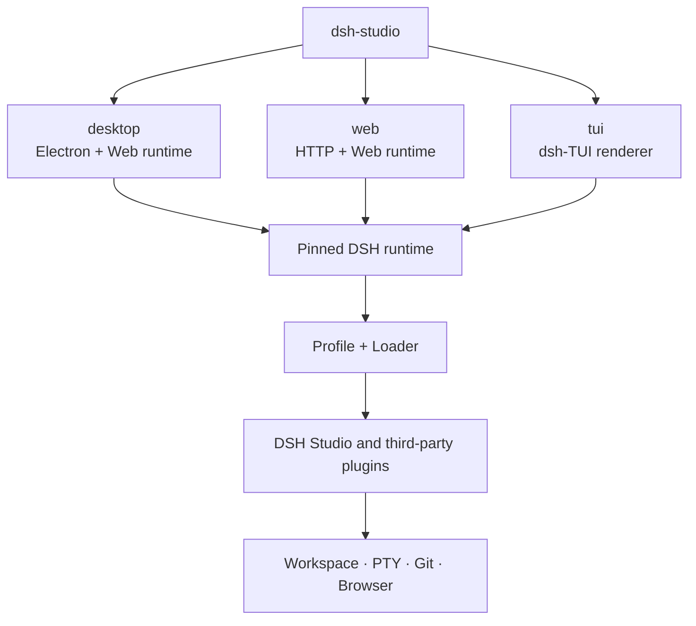
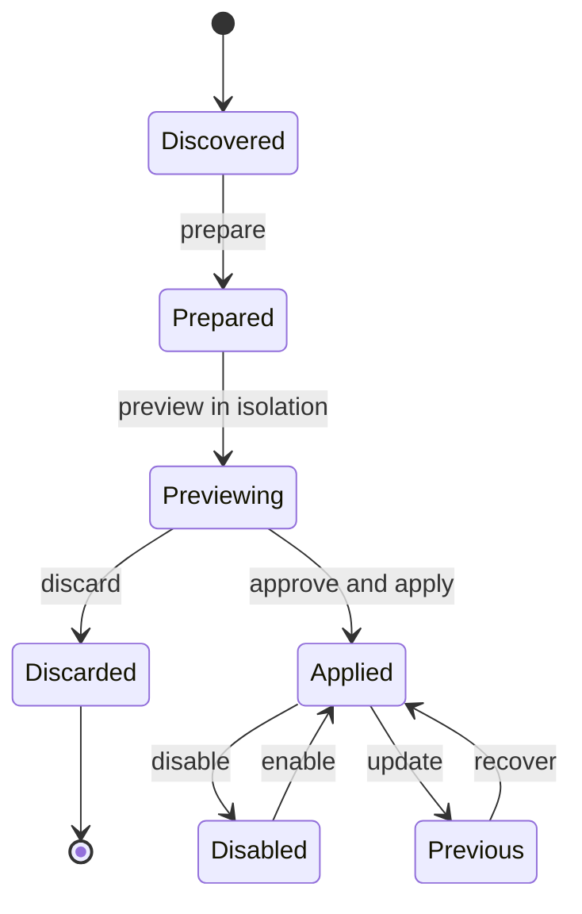

  <a href="./design.md">简体中文</a> ·
  <strong>English</strong> ·
  <a href="../README.en.md">Back to README</a>

# DSH Studio design and plugin boundaries

## Goals

DSH Studio provides Desktop, Web, and TUI over one pinned DSH runtime.
The surfaces share sessions, Profiles, plugin contracts, and local
capabilities, while each package carries only the interaction layer it needs.
Lightweight deployments do not have to install Electron.

Design principles:

- Reuse DSH Profile, Loader, locale, settings, and ThemeService contracts.
- Desktop is the full distribution; Web and TUI can be packaged separately.
- Keep one Host and one permission boundary for each capability.
- Human and Agent plugin actions share the same preview and commit transaction.
- Synchronize upstream features without replacing the DSH Studio UI or themes.

## Surface architecture

`dsh-studio` only selects an interaction surface. Runtime capabilities remain
under DSH Profile and Loader management, so separate packages never create a
second plugin system.

## Distribution boundaries

| Package | Includes | Excludes |
| --- | --- | --- |
| Full/Desktop | Electron, Web runtime, TUI, Node, bundled plugins, unified CLI | Nothing |
| Web-only | HTTP/Web runtime, Node, Web-compatible plugins, unified CLI | Electron and native window features |
| TUI-only | dsh-TUI renderer, Node, TUI-compatible plugins, unified CLI | Electron and browser UI |

Desktop itself uses the Web UI, so DSH Studio does not ship a degraded
"Desktop-only" package. Web-only and TUI-only remove Electron; TUI-only is
the smallest supported distribution.

## Bundled plugins and upstreams

| Plugin | Relationship | DSH Studio boundary |
| --- | --- | --- |
| `@dsh-studio/desktop` | Native | Unified entry, window, menu, bridge, and bundled-plugin registration |
| `@dsh-studio/capabilities` | Pins and adapts [`DSH-better-sidebar`](https://github.com/omdsh-dev/DSH-better-sidebar) | DSH Studio Host capability gateway: PTY, Files, Git, WorkTrees, Workspaces, jobs, and Agent tools |
| `@dsh-studio/sidebar` | Downstream Better Sidebar UI adapter | Reuses the Host while retaining DSH Studio layout, icons, themes, Review, and comments |
| `@dsh-studio/panel-controls` | Downstream implementation of the `dsh-web-panel` interaction model | Unified Terminal dock without a separate Web Terminal install |
| `@dsh-studio/pinned-summary` | Native | Session summary, half-height card, and content-gutter management |
| `@dsh-studio/plugin-marketplace` | Adopts lifecycle ideas from `plugin-registry` and `dsh-hub` | One Loader, isolated preview, risk approval, TOFU source lock, and recovery |
| `@dsh-studio/skins` | Downstream implementation of the `dsh-skins` ThemeService model | One skin id set, Host persistence, Web/Desktop CSS, and TUI palette adapters |
| `@dsh-studio/vision` | Adapts [`dsh-vision`](https://github.com/william-jin-cmu/dsh-vision) | Cross-surface `view_image` Host tool with cloud/local OCR fallback; DeepSeek V4 is admitted at the final image-capability check and its native attachments are described before the pinned text-only adapter, while DSH owns paste, thumbnails, and submission through its native attachment rail; reuses DSH credentials and settings |
| `dsh-cc-tui` | Pins [`dsh-TUI`](https://github.com/ccch1mneyyy/dsh-TUI) | Upstream owns terminal rendering, session interaction, commands, and terminal compatibility |
| `@dsh-studio/tui` | Downstream Profile adapter for `dsh-TUI` | Unified `dsh-studio tui`, DSH Studio TUI identity, defaults, packaging, and DSH data boundary |

Downstream plugins periodically inspect upstream features and adapt them to
the current DSH contracts. Upstream code, the DSH Studio UI, and final permission
boundaries remain separate layers.

`@dsh-studio/skins` is the only skin-definition module for all three surfaces.
Web and Desktop adapt the catalog to DSH CSS tokens; TUI adapts the same ids
to the upstream native `/theme` palettes. TUI retains upstream hot switching
and its picker, then mirrors the choice into the shared `skins.json` on the
next launch. There is no second theme loader.

## Workbench kernel contracts

The right-panel workbench converges open semantics and state scoping onto the
shared kernel contract `@dsh-studio/shared/workbench-contracts`:

- `resolveOpenPlan` is the single open-decision table: intent
  (`preview`/`pin`/`background`) × the `centerPreviewTabs` preference ⇒ area,
  replaceable-preview, and activation. The focus invariant (an open never
  moves keyboard focus) is upheld by every caller.
- `resolveScopeBucket` is the single state-bucket decision across
  `workspace`/`session`/`global`; `global` collapses onto one bucket. The
  sidebar layout and its remembered width implement the `layoutScope`
  preference through it; center-surface queues always bucket by cwd because
  their objects are workspace-bound.
- Upstream DOM probes must live in exactly one module per plugin (`dsh-dom.ts`
  for the sidebar).

## Plugin installation transaction

`installed` and `enabled` are separate states. Installation and updates pin
the source and commit before entering an isolated preview. Only explicit
application changes the current Profile. Agent-initiated installs use the
same transaction and risk approval and cannot bypass the Loader.

## Marketplace extension

The marketplace accepts both catalog entries and public GitHub repository
references. A Host resolver canonicalizes the reference, resolves an exact
commit, validates `package.json`, `dsh.bundle.patch`, patch and entry files,
peer compatibility, license, and lifecycle scripts, then emits one
`MarketplaceCandidate` and normalized `github:owner/repo#<sha>` install spec.

Only packages that declare the pinned DSH bundle contract are installable.
`.dsh-plugin` and repository-plugin metadata remain diagnostic-only and cannot
produce an apply-capable plan. Catalog and direct repository candidates share
the existing isolated preview, approval, atomic Profile replacement, rollback,
and Undo transaction. The UI and Agent consume the same Host approval decision.

The mandatory static fixture is
`JUSTMONIKA2022/dsh-sandbox-escalation-fix@19f2cb4cecc178313d2f54458badfc1bcb8bc816`.
This repository is verified by source and isolated fixture tests only; this
checkout does not install or run it.

## Left-rail architecture

The facts, deep-module seam, semantic commands, project-icon resolution, and physical Worktree deletion rules for the Project → Worktree → Session rail are documented in the [left-rail architecture](./left-rail-architecture.en.md). That document freezes architecture only; implementation has not started.

## Security boundaries

- Web binds to loopback by default; LAN exposure requires trusted authorities.
- Files, PTY, and Git requests are bound to the active Session and Workspace.
- Local `view_image` reads are bound to the active Session workspace; remote
  vision requests go only to the user-configured endpoint.
- Desktop/Web image paste, thumbnails, and submission remain owned by DSH's
  attachment store and native attachment rail; `@dsh-studio/vision` augments the
  final DeepSeek V4 image-admission capability check and describes those native
  attachments before the pinned text-only adapter serializes the request.
- Marketplace candidate, current, and previous states remain separate.
- A source receives a TOFU lock on first use; later commit changes need review.
- The Electron bridge exists only on Desktop; Web does not emulate its rights.
- TUI starts only on a real TTY and retains the active DSH Profile's sandbox
  and approval policies.

## Naming and data root

User-facing names are **DSH Studio**, **DSH Studio Web**, and **DSH Studio TUI**.
Internal package ids and the bundle id remain stable. All three surfaces use
`~/.dsh-studio`, keep their compositions in separate Profiles, and share sessions,
credentials, skins, and plugin caches. `DSH_STUDIO_HOME` is the common override.
`DSH_STUDIO_CHANNEL=stable|dev` selects the sibling default roots `~/.dsh-studio` and
`~/.dsh-studio-dev` so an installed Desktop can run beside a source verification
instance. The Web and TUI `--data` flags override only the current process.

See [installation, operations, and troubleshooting](./usage.en.md).

## Unified hover comments

File viewing and diff views share ONE hover-comment interaction (R2): a
hovering gutter `+` opens an inline composer (Enter commits / Shift+Enter
newline / Esc dismisses) that writes to the unified batch store
(`diff-comments-store` v2; anchor path+startLine/endLine+contentHash, resolve
lifecycle) or "reference in chat" lightweight composer injection. Interaction
uses the official `@pierre/diffs` hooks (renderGutterUtility / onLineEnter) —
no DOM scraping; the legacy diff bottom form is removed. Markdown preview
keeps selection-references (no stable line numbers); its source view is a
code view and supports line comments.
