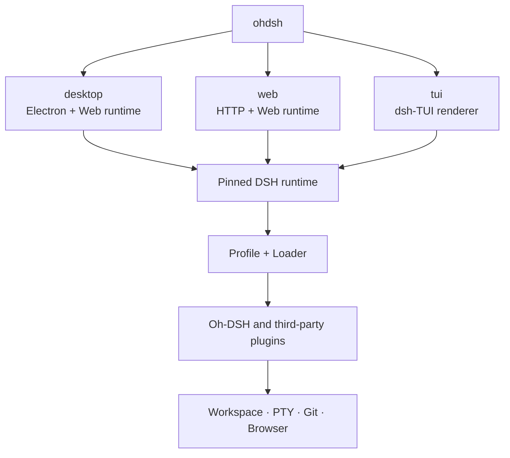
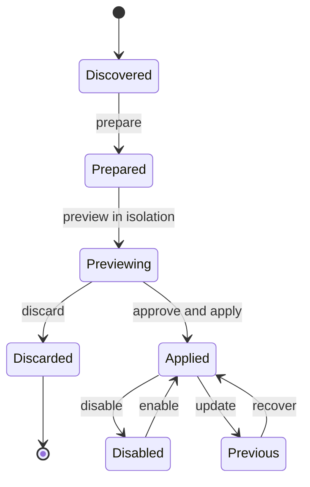

  <strong>简体中文</strong> ·
  <a href="./design.en.md">English</a> ·
  <a href="../README.md">返回 README</a>

# Oh-DSH 设计与插件边界

## 目标

Oh-DSH 在同一份固定 DSH runtime 上提供 Desktop、Web 和 TUI。
各形态共享会话、Profile、插件契约和本地能力，但只携带自身需要的交互层，
避免为轻量部署强制安装 Electron。

设计原则：

- 复用 DSH Profile、Loader、locale、settings 和 ThemeService。
- Desktop 是完整发行版，Web/TUI 可以独立打包。
- 同一种能力只有一个 Host 和一套权限边界。
- 人类 UI 与 Agent 安装插件时共用同一套预览与提交事务。
- 上游能力按 feature 同步，不直接覆盖 Oh-DSH 的 UI 与主题。

## 形态架构

`ohdsh` 只负责选择交互形态。运行时能力继续由 DSH Profile 和 Loader 管理，
因此独立安装不会引入第二套插件系统。

## 发行边界

| 发行包 | 包含 | 不包含 |
| --- | --- | --- |
| Full/Desktop | Electron、Web runtime、TUI、Node、内置插件、统一 CLI | 无 |
| Web-only | HTTP/Web runtime、Node、Web 可用插件、统一 CLI | Electron 和桌面窗口能力 |
| TUI-only | dsh-TUI renderer、Node、TUI 可用插件、统一 CLI | Electron 和浏览器 UI |

Desktop 本身使用 Web UI，因此不再制造一个功能残缺的“Desktop-only”包。
Web-only 与 TUI-only 都去掉 Electron；TUI-only 是容量最小的发行形态。

## 内置插件与上游关系

| Plugin | 来源关系 | Oh-DSH 边界 |
| --- | --- | --- |
| `@oh-dsh/desktop` | 自研 | 统一入口、窗口、菜单、bridge 和内置插件注册 |
| `@oh-dsh/better-sidebar-runtime` | 固定跟踪 [`DSH-better-sidebar`](https://github.com/omdsh-dev/DSH-better-sidebar) | 编译上游 Host；提供 PTY、Files、Git、历史和 commit diff |
| `@oh-dsh/sidebar` | Better Sidebar 的下游 UI 适配 | 复用 Host，保留 Oh-DSH 布局、图标、主题、Review 与评论交互 |
| `@oh-dsh/panel-controls` | 对 `dsh-web-panel` 交互模型的下游实现 | 提供统一 Terminal dock，不要求单独安装 Web Terminal |
| `@oh-dsh/pinned-summary` | 自研 | 会话摘要、半高卡片和正文 gutter 管理 |
| `@oh-dsh/plugin-marketplace` | 吸收 `plugin-registry` 与 `dsh-hub` 的生命周期设计 | 单一 Loader、隔离预览、风险确认、TOFU 来源锁与恢复 |
| `@oh-dsh/skins` | 对 `dsh-skins` ThemeService 扩展模型的下游实现 | 一套皮肤 ID、Host 持久化，以及 Web/Desktop CSS 与 TUI 调色板适配器 |
| `@oh-dsh/vision` | 适配 [`dsh-vision`](https://github.com/william-jin-cmu/dsh-vision) | 跨三端的 `view_image` Host 工具和云端/本地 OCR 回退；DeepSeek V4 在最终图片能力校验处放行，并在固定的 text-only 适配器序列化前描述原生附件；图片粘贴、缩略图和提交全部由 DSH 原生 attachment rail 负责；复用 DSH credentials 与 settings |
| `dsh-cc-tui` | 固定跟踪 [`dsh-TUI`](https://github.com/ccch1mneyyy/dsh-TUI) | 上游拥有终端渲染、会话交互、命令与终端兼容性 |
| `@oh-dsh/tui` | `dsh-TUI` 的下游 Profile 适配 | 统一 `ohdsh tui`、Oh-DSH TUI 标题、默认值、发行打包和 DSH 数据边界 |

下游插件会定期检查上游 feature，并在当前 DSH 契约上重新适配。上游代码、
Oh-DSH UI 和最终权限边界不会混为一层。

`@oh-dsh/skins` 是三个交互面的唯一皮肤定义模块。Web 与 Desktop 把定义
适配为 DSH CSS token；TUI 把同一组 ID 适配为上游原生 `/theme` 调色板。
TUI 仍使用上游的热切换与选择器，选择会在下一次启动时回写统一的
`skins.json`，没有第二套主题 Loader。

## 插件安装事务

`installed` 与 `enabled` 分离。安装或更新先固定来源与 commit，再进入隔离预览；
只有显式应用才会改变当前 Profile。Agent 发起安装时也必须经过相同的事务和
风险确认，不能绕过 Loader。

## Marketplace 扩展交接

后续的多来源 catalog、直接公开仓库检查、bundle-only 安装、隔离预览和
`dsh-sandbox-escalation-fix` 强制验收，见[插件市场扩展实施规划](./plugin-marketplace-expansion-plan.md)
和[插件市场改造交接文档](./plugin-marketplace-handoff.md)。这两份文档定义
实现顺序、source/candidate seam、当前 pinned DSH 的死路径和接手验收矩阵。

## 安全边界

- Web 默认只监听 loopback；对局域网开放时必须配置可信 authority。
- Files、PTY 和 Git 请求绑定当前 Session 与 Workspace。
- `view_image` 的本地文件读取绑定当前 Session Workspace；远程视觉请求只发送到用户配置的端点。
- Desktop/Web 的图片粘贴、缩略图和提交全部由 DSH attachment store 与原生
  attachment rail 负责；`@oh-dsh/vision` 在 DeepSeek V4 的最终图片 admission
  check 处补充能力元数据，并在 text-only 适配器序列化前描述这些原生附件。
- Marketplace 的 candidate、current、previous 分离，失败可以恢复。
- 来源首次使用采用 TOFU 锁，后续 commit 变化需要重新确认。
- Electron bridge 只存在于 Desktop；Web 不模拟桌面权限。
- TUI 只在真实 TTY 中启动，并继续使用 DSH Profile 的 sandbox 与 approval。

## 名称与数据目录

面向用户的名称是 **Oh-DSH Desktop**、**Oh-DSH Web** 和
**Oh-DSH TUI**。内部 package id 与 bundle id 保持稳定。三个界面共同使用
`~/.ohdsh`，通过独立 Profile 隔离组合，并共享会话、凭据、皮肤与插件缓存。
`OH_DSH_HOME` 是统一覆盖入口；`OH_DSH_CHANNEL=stable|dev` 在默认根目录旁
选择 `~/.ohdsh` 或 `~/.ohdsh-dev`，让已安装 Desktop 与源码验证实例并行。
Web 与 TUI 的 `--data` 只覆盖当前进程。

相关操作见[安装、操作与排错](./usage.md)。
