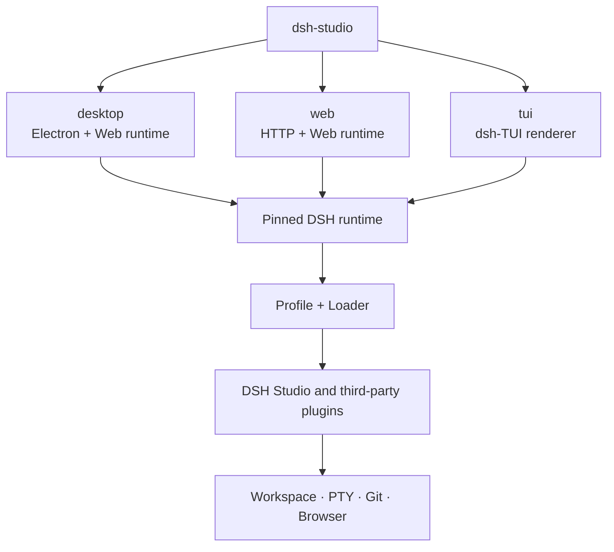
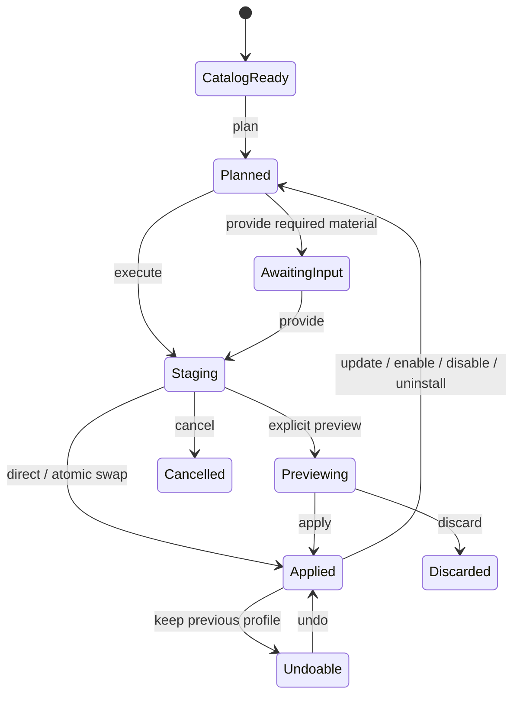

<p align="center">
  <strong>简体中文</strong> ·
  <a href="./design.en.md">English</a> ·
  <a href="../README.md">返回 README</a>
</p>

# DSH Studio 设计与插件边界

## 目标

DSH Studio 在同一份固定 DSH runtime 上提供 Desktop、Web 和 TUI。
各形态共享会话、Profile、插件契约和本地能力，但只携带自身需要的交互层，
避免为轻量部署强制安装 Electron。

设计原则：

- 复用 DSH Profile、Loader、locale、settings 和 ThemeService。
- Desktop 是完整发行版，Web/TUI 可以独立打包。
- 同一种能力只有一个 Host 和一套权限边界。
- 人类 UI 与 Agent 安装插件时共用同一套预览与提交事务。
- 上游能力按 feature 同步，不直接覆盖 DSH Studio 的 UI 与主题。

## 形态架构



`dsh-studio` 只负责选择交互形态。运行时能力继续由 DSH Profile 和 Loader 管理，
因此独立安装不会引入第二套插件系统。

## 发行边界

| 发行包 | 包含 | 不包含 |
| --- | --- | --- |
| Full/Desktop | Electron、Web runtime、TUI、Node、内置插件、统一 CLI | 无 |
| Web-only | HTTP/Web runtime、Node、Web 可用插件、统一 CLI | Electron 和桌面窗口能力 |
| TUI-only | dsh-TUI renderer、Node、TUI 可用插件、统一 CLI | Electron 和浏览器 UI |

Desktop 本身使用 Web UI，因此不再制造一个功能残缺的“Desktop-only”包。
Web-only 与 TUI-only 都去掉 Electron；TUI-only 是容量最小的发行形态。

## 内置插件与上游关系

| Plugin | 来源关系 | DSH Studio 边界 |
| --- | --- | --- |
| `@dsh-studio/desktop` | 自研 | 统一入口、窗口、菜单、bridge 和内置插件注册 |
| `@dsh-studio/capabilities` | 固定跟踪 [`DSH-better-sidebar`](https://github.com/omdsh-dev/DSH-better-sidebar) 并扩展 | DSH Studio Host 能力网关：PTY、Files、Git、WorkTree、Workspace、作业和 Agent 工具 |
| `@dsh-studio/sidebar` | Better Sidebar 的下游 UI 适配 | 复用 Host，保留 DSH Studio 布局、图标、主题、Review 与评论交互 |
| `@dsh-studio/panel-controls` | 对 `dsh-web-panel` 交互模型的下游实现 | 提供统一 Terminal dock，不要求单独安装 Web Terminal |
| `@dsh-studio/pinned-summary` | 自研 | 会话摘要、半高卡片和正文 gutter 管理 |
| `@dsh-studio/plugin-marketplace` | DSH Studio 的 canonical catalog 与事务实现 | 单一 Loader、candidate staging、低风险直装、可选隔离预览、风险确认、TOFU 来源锁与恢复 |
| `@dsh-studio/skins` | 对 `dsh-skins` ThemeService 扩展模型的下游实现 | 一套皮肤 ID、Host 持久化，以及 Web/Desktop CSS 与 TUI 调色板适配器 |
| `@dsh-studio/vision` | 适配 [`dsh-vision`](https://github.com/william-jin-cmu/dsh-vision) | 跨三端的 `view_image` Host 工具和云端/本地 OCR 回退；DeepSeek V4 在最终图片能力校验处放行，并在固定的 text-only 适配器序列化前描述原生附件；图片粘贴、缩略图和提交全部由 DSH 原生 attachment rail 负责；复用 DSH credentials 与 settings |
| `dsh-cc-tui` | 固定跟踪 [`dsh-TUI`](https://github.com/ccch1mneyyy/dsh-TUI) | 上游拥有终端渲染、会话交互、命令与终端兼容性 |
| `@dsh-studio/tui` | `dsh-TUI` 的下游 Profile 适配 | 统一 `dsh-studio tui`、DSH Studio TUI 标题、默认值、发行打包和 DSH 数据边界 |

下游插件会定期检查上游 feature，并在当前 DSH 契约上重新适配。上游代码、
DSH Studio UI 和最终权限边界不会混为一层。

`@dsh-studio/skins` 是三个交互面的唯一皮肤定义模块。Web 与 Desktop 把定义
适配为 DSH CSS token；TUI 把同一组 ID 适配为上游原生 `/theme` 调色板。
TUI 仍使用上游的热切换与选择器，选择会在下一次启动时回写统一的
`skins.json`，没有第二套主题 Loader。

## 插件安装事务



`installed` 与 `enabled` 分离。`plan` 只解析来源、固定 commit、校验 manifest、
兼容性和风险；`execute` 使用同一 candidate staging 实现。低风险且无需材料或
确认的计划可以直接原子替换 live Profile，其他计划可显式启动隔离预览后再
应用。Agent 与 UI 共用同一个 Loader、事务 owner、来源锁、恢复和 Undo。

## Marketplace 实现

插件市场的完整 P0/P1/P2 功能、canonical `MarketplaceCommand`、catalog schema、
GitHub/npm/tarball 精确来源、candidate staging、风险分级直装、可选隔离预览、
进度/材料/整合包/watchlist 与恢复语义，统一记录在[插件市场改造设计](./plugin-marketplace-redesign.md)。
实现必须保持单一 Loader 与单一事务 owner，不得恢复旧的 registry reader 或
`inspect/prepare/preview` 命令别名。

## 左栏架构

Project → Worktree → Session 左栏的事实来源、深模块 seam、语义命令、项目图标解析和物理 Worktree 删除约束，见[左栏架构设计](./left-rail-architecture.md)。该文档当前只冻结架构，不代表实现已经开始。

## 安全边界

- Web 默认只监听 loopback；对局域网开放时必须配置可信 authority。
- Files、PTY 和 Git 请求的 cwd 经服务端 workspace scope 注册表校验
  （已注册工作区根 ∪ 活跃会话 cwd，未注册目录返回 forbidden）；读写路径再过
  会话子树围栏——读类以服务端解析的仓库根为锚，兼容子目录会话。同源
  loopback 栅栏只是传输层防线，不是认证。
- `view_image` 的本地文件读取绑定当前 Session Workspace；远程视觉请求只发送到用户配置的端点。
- Desktop/Web 的图片粘贴、缩略图和提交全部由 DSH attachment store 与原生
  attachment rail 负责；`@dsh-studio/vision` 在 DeepSeek V4 的最终图片 admission
  check 处补充能力元数据，并在 text-only 适配器序列化前描述这些原生附件。
- Marketplace 的 candidate、current、previous 分离，失败可以恢复。
- 来源首次使用采用 TOFU 锁，后续 commit 变化需要重新确认。
- Electron bridge 只存在于 Desktop；Web 不模拟桌面权限。
- TUI 只在真实 TTY 中启动，并继续使用 DSH Profile 的 sandbox 与 approval。

## 名称与数据目录

面向用户的名称是 **DSH Studio**、**DSH Studio Web** 和
**DSH Studio TUI**。内部 package id 与 bundle id 保持稳定。三个界面共同使用
`~/.dsh-studio`，通过独立 Profile 隔离组合，并共享会话、凭据、皮肤与插件缓存。
`DSH_STUDIO_HOME` 是统一覆盖入口；`DSH_STUDIO_CHANNEL=stable|dev` 在默认根目录旁
选择 `~/.dsh-studio` 或 `~/.dsh-studio-dev`，让已安装 Desktop 与源码验证实例并行。
Web 与 TUI 的 `--data` 只覆盖当前进程。

相关操作见[安装、操作与排错](./usage.md)。

## Workbench 内核契约

右栏工作台的打开语义与状态作用域收敛到共享内核契约
`@dsh-studio/shared/workbench-contracts`，并由 `plugins/workbench` 的四个内核服务
承载（均已实现，见下）。持久化 slice 的类型词汇仍由 shared contracts 提供，
但没有独立的 `workbench.state` runtime service。旧路径（散落的打开/布局/状态入口）已清零：

- `SurfaceRegistry`：center/left/right 各区域的 surface 唯一注册表；
  注册即声明区域归属与生命周期，消费方不得自建第二张表。
- `OpenPipeline`：唯一打开决策管线。intent（`preview`/`pin`/`background`）×
  `resolveOpenPlan` ⇒ 区域、是否可替换预览、是否激活；焦点不变式（打开永不移动
  键盘焦点）由管线统一维护，调用方不再各自决定。
- `LayoutService`：跨插件布局协商。侧栏宽度策略留在 sidebar 域（持久化上限 4096、
  视口 75% 现算），服务只接收最终占位并协调各区域 footprint 与 overlay 挂载
  （经 `@dsh-studio/shared/layout-dom` 的 `ensureLayoutDom`）。
- 状态持久化不再由独立的 `workbench.state` 服务暴露。共享
  `StateSliceDefinition` 保留 schema/version 词汇，实际持久化经 `persistVia`
  落到 host-owned backend；仍由各域按 workspace/session/global 约定分桶，
  center surface 队列恒按 cwd 分桶。
- `WorkspaceEvents`：工作区/会话身份事件源。 `onWorkspaceChanged` /
  `onSessionChanged` 由单一身份泵（runtime `currentProvideInfo` 投影）驱动，
  workspace 先于 session 派发；GitWatch/websocket 新鲜度事件保留在
  source-control 域，不并入本服务。

上游 DOM 探测仍收口在每个插件的单个探针模块（sidebar 为 `dsh-dom.ts`）。

## 数据流与持久化（Data flow & persistence）

客户端不直接持有服务端数据；取数与持久化统一走 DSH 运行时的既有管道，
组件只消费 zustand store 与运行时缓存。语义见 `.workflow/specs/`
（S1–S3），并被 `scripts/guards/*.mjs` 强制：

```text
  client store / component
      │  render             订阅
      ▼                          ▼
  zustand store(纯内存)  ──────────►  shared/runtime RevisionedStore/GenerationGate
      │  persistVia(store,{table,sanitize,merge,debounceMs})
      ▼
  共享 persistVia 门面 ──────────────► host 域后端
      │                              ├── ui-chrome 表（capabilities ui-chrome.get/put JSON）
      │                              ├── settings 命名空间（replace/mutate）
      │                              └── nodeFs（文件系统原子写）
      ▼
  transport：capabilities JSON / ui-chrome / settings / WS / IPC
      ▼
  cordis 服务（capabilities、terminal、marketplace…）
      ▼
  data-root  ~/.dsh-studio / ~/.dsh-studio-dev（按 DSH_STUDIO_CHANNEL）
```

要点：
- **唯一取数形态**：RPC 缓存走 shared/runtime RevisionedStore 家族（按
  cwd/scope 键控、软刷新、mutation 精准失效）；命令式 mutation 收敛到单
  lane 并在 store action 中包装；事件推送（如 marketplace changed）由 host
  状态跃迁触发，store 订阅 revalidate。禁止组件内手写
  loading/error/data 三件套或散落裸 `callCapabilitiesApi`。
- **唯一持久化路径**：经 `persistVia` 落 host 域后端。`localStorage` /
  `sessionStorage` 仅作为 legacy 迁移源（如 comments-migration.ts 一把读入
  ui-chrome 表），绝非运行期写通道。
- **运行时缓存唯一形态**：同一工作区的多 surface 共享一份
  ScopedRuntimeRegistry 实例，禁止各自为政另建缓存。

## 统一悬浮评论（Unified hover comments）

文件查看与 diff 视图共用一套悬浮评论（R2）：悬停行号槽 `+` → 行内输入框
（Enter 提交 / Shift+Enter 换行 / Esc 关闭）→ 评论写入统一批注库
（`diff-comments-store` v2，锚定 path+startLine/endLine+contentHash，
支持 resolve 生命周期）或"引用到对话"轻量注入 composer。交互经
`@pierre/diffs` 官方钩子（renderGutterUtility/onLineEnter），无 DOM 刮削；
diff 底部表单已废弃删除。Markdown 渲染预览态无稳定行号，保留划选引用。
